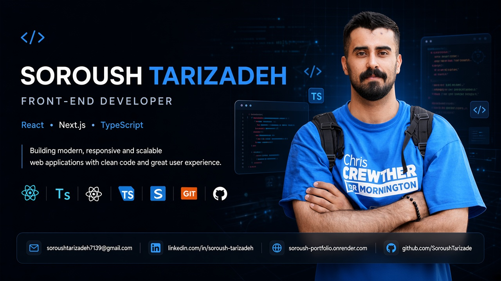

  

<h1 align="center">Soroush Tarizadeh</h1>

  <strong>Frontend Developer</strong>
   
  React · Next.js · TypeScript

  Building modern, responsive and production-oriented web applications
  with a focus on clean UI, reusable components and practical engineering.

  
  

---

## 👨‍💻 About Me

I'm a **Frontend Developer** focused on the React ecosystem and modern web application development.

I build applications that go beyond static interfaces — combining responsive UI, reusable components, API integration, authentication, database-driven features and real user flows.

My main stack is **React, Next.js, TypeScript and Tailwind CSS**, with additional experience working with MongoDB, Mongoose, REST APIs and cloud services.

I enjoy turning designs and product ideas into functional, maintainable and production-oriented applications.

🎓 **University of Tehran**  
💼 **Open to Junior Frontend Developer opportunities**

---

## 🧰 Tech Stack

### Core Frontend

  

### Application & Data

  

  
  
  
  

### Libraries & Services

  
  
  
  
  
  
  
  
  

### Development Tools

  

---

# 🚀 Featured Projects

<table>
<tr>
<td width="50%" valign="top">

<h3>🏠 Saqfino</h3>

<strong>Full-Stack Persian Real Estate Platform</strong>

A production-oriented RTL real-estate application built with Next.js and TypeScript, featuring real authentication, property management, database integration and cloud services.

<strong>Highlights</strong>

<ul>
  <li>🔐 Secure authentication & email verification</li>
  <li>🛡️ Session-based protected user flows</li>
  <li>🏡 Property submission & management</li>
  <li>🔎 Server-side search, filtering & sorting</li>
  <li>🗺️ Interactive maps with Leaflet</li>
  <li>☁️ Cloudinary image management</li>
  <li>🗄️ MongoDB & Mongoose</li>
  <li>📱 Responsive Persian RTL interface</li>
</ul>

<strong>Stack</strong>

<code>Next.js</code>
<code>React</code>
<code>TypeScript</code>
<code>Tailwind CSS</code>
<code>MongoDB</code>
<code>Mongoose</code>
<code>Cloudinary</code>
<code>Leaflet</code>

<a href="https://saqfinoapp.ir">🌐 Live Demo</a>
&nbsp;•&nbsp;
<a href="https://github.com/SoroushTarizade/saqfino">💻 Source Code</a>

</td>

<td width="50%" valign="top">

<h3>📊 DashStack</h3>

<strong>Modern Admin Dashboard</strong>

A full-stack admin dashboard focused on reusable UI, authentication, data management and realistic application workflows.

<strong>Highlights</strong>

<ul>
  <li>🔐 Authentication & session management</li>
  <li>🛡️ Protected routes</li>
  <li>➕ CRUD operations</li>
  <li>🔎 Search & filtering</li>
  <li>📄 Pagination</li>
  <li>🗄️ MongoDB integration</li>
  <li>📈 Data visualization</li>
  <li>🌗 Light & dark mode</li>
  <li>📱 Responsive dashboard UI</li>
</ul>

<strong>Stack</strong>

<code>Next.js</code>
<code>React</code>
<code>TypeScript</code>
<code>Tailwind CSS</code>
<code>MongoDB</code>
<code>Mongoose</code>
<code>bcrypt</code>

<a href="https://modern-admin-dashboard-one.vercel.app/">🌐 Live Demo</a>
&nbsp;•&nbsp;
<a href="https://github.com/SoroushTarizade/modern-admin-dashboard">💻 Source Code</a>

</td>
</tr>

<tr>
<td width="50%" valign="top">

<h3>🛒 Clothes Shop</h3>

<strong>Modern E-Commerce Application</strong>

A responsive e-commerce application built with Next.js and React, focused on common shopping flows and API-driven product experiences.

<strong>Highlights</strong>

<ul>
  <li>🔐 Authentication</li>
  <li>🛍️ Shopping cart</li>
  <li>🔎 Product search</li>
  <li>🗂️ Category filtering</li>
  <li>🔌 External API integration</li>
  <li>📱 Responsive interface</li>
</ul>

<strong>Stack</strong>

<code>Next.js</code>
<code>React</code>
<code>Tailwind CSS</code>
<code>Axios</code>
<code>Fake Store API</code>

<a href="https://clotheshop.onrender.com">🌐 Live Demo</a>
&nbsp;•&nbsp;
<a href="https://github.com/SoroushTarizade/clotheshop">💻 Source Code</a>

</td>

<td width="50%" valign="top">

<h3>🌐 Personal Portfolio</h3>

<strong>Bilingual Frontend Developer Portfolio</strong>

A bilingual personal portfolio built with Next.js, React and TypeScript to showcase projects, technical skills and frontend work.

<strong>Highlights</strong>

<ul>
  <li>🌍 English & Persian experiences</li>
  <li>↔️ LTR & RTL support</li>
  <li>📱 Responsive layouts</li>
  <li>⚡ Next.js App Router</li>
  <li>🔍 Localized SEO metadata</li>
  <li>📬 Functional contact form</li>
  <li>📧 Server-side email handling</li>
  <li>🧩 Reusable component architecture</li>
</ul>

<strong>Stack</strong>

<code>Next.js</code>
<code>React</code>
<code>TypeScript</code>
<code>Tailwind CSS</code>
<code>Resend</code>

<a href="https://soroushtarizadeh.vercel.app/">🌐 Live Demo</a>
&nbsp;•&nbsp;
<a href="https://github.com/SoroushTarizade/portfolio">💻 Source Code</a>

</td>
</tr>
</table>

---

## 🧠 What I Bring

- ⚛️ **React & Next.js** — building component-based modern web applications
- 🧩 **Reusable Architecture** — organizing interfaces around maintainable components
- 🎨 **UI Implementation** — translating Figma designs into responsive interfaces
- 🔐 **Real Application Flows** — authentication, protected routes and user workflows
- 🔌 **API Integration** — connecting frontend applications to real data and services
- 🗄️ **Data-driven Applications** — working with MongoDB and Mongoose
- 📱 **Responsive & RTL Development** — building experiences for different screen sizes and languages
- 🚀 **Production-oriented Development** — deployment, environment variables and real third-party services

---

## 🏗️ Development Approach

I don't see frontend development as only building interfaces.

I focus on how the **UI, components, data, APIs, authentication and user flows** work together as one application.

My goal is to write code that is not only functional, but also **clear, reusable and maintainable**.

---

## 🎓 Education

**University of Tehran**

Faculty of Social Sciences

---

## 💼 Open to Opportunities

I'm currently open to **Junior Frontend Developer** opportunities.

I'm particularly interested in teams building modern web products with:

`React` · `Next.js` · `TypeScript` · `JavaScript`

---

## 📫 Connect With Me

  

  

  

  

  Thanks for visiting my profile.

